# EdgeCore

Hardware-Adaptive Runtime & Deployment Compiler for Sovereign Small Language Models (SLMs).

EdgeCore is a **research / B.Tech Major Project** system that automatically optimizes and
packages a small language model for *your* hardware. You give it a model plus your CPU;
it exports the model, proves the export is correct, benchmarks a space of execution
configurations on real hardware, picks the best one for your goal, and emits a
reproducible offline deployment bundle.

> Think "auto-tuner + verification gate + packager" for on-device / on-premise /
> air-gapped SLM inference — no manual `llama.cpp`-style knob-twiddling required.

---

## What it does

```
 Model + Hardware + Workload + Constraints
                  |
                  v
 +--------------------------------------------------------------+
 | EdgeCore                                                      |
 |   1. export    HF safetensors -> .ecm (fp16 / int8-per)      |
 |   2. analyze   model characteristics (params, memory, FLOPs)  |
 |   3. verify    C-runtime vs fp32 ground truth (cosine/top1/ppl)|
 |   4. bench     grid search + Pareto front on real hardware     |
 |   5. package   verified config + runtime + reports -> bundle  |
 +--------------------------------------------------------------+
                  |
                  v
 Optimized execution config + verification report + deployment package
```

The Python toolchain (`edgecore/`) builds and validates models; the C runtime (`src/`)
is the actual deployable inference engine (INT8/FP16 GEMM, AVX2/AVX512, OpenMP
threading, fp16 KV cache, BPE tokenizer, arena allocation).

---

## Live demo (real `make e2e` run)

The animation below is an actual recorded run of `make e2e` (fetch -> export -> verify
-> benchmark/autotune -> package) on an 11th-gen Intel Core i3 (4 logical cores, 8.1 GB
RAM), showing the search grid, the accuracy gate catching a bad int8 export, and the
automatic fallback to a verified config:



What happens in the demo, step by step:

1. **Tiny sanity pass** — a 2-layer synthetic model is exported, verified, and benched
   to confirm the toolchain works before touching real weights.
2. **Fetch** — downloads `openai-community/gpt2` (124M params) from Hugging Face.
3. **Export** — writes two artifacts: `gpt2-fp16.ecm` (lossless) and `gpt2-int8-per.ecm`
   (per-channel 8-bit, ~40% smaller).
4. **Verify** — the int8 artifact **FAILS** the accuracy gate
   (`top1=0.9375`, `ppl_ratio=1.0444` vs required `>=0.95` / `<=1.05`), while fp16
   passes cleanly. EdgeCore refuses to ship the lossy one.
5. **Bench** — a 16-combination grid `(precision x threads x batch x affinity)` is
   measured on the real CPU. int8 is fastest (88.7 tok/s) but unverified, so...
6. **Package** — EdgeCore automatically falls back to the **best verified** config
   (fp16, 2 threads, batch 1) and emits `dist/gpt2-fp16-balanced.tar.gz` with the
   tuned config, the runtime, and all reports.

Run it yourself to get numbers specific to your machine.

---

## Repository layout

| Path | Contents |
|------|----------|
| `edgecore/` | Python toolchain: `export`, `reference`, `tokenizer`, `analyze`, `bench`, `verify`, `package`, `ecm`, `cli` |
| `src/` | C inference runtime, kernels, tokenizer, hardware profiler |
| `scripts/` | model fetch, synthetic-model generator, smoke test |
| `docs/` | this project's documentation & the animated e2e demo |
| `build/` | compiled `edgecore-runtime` + `edgecore-hwprof` (generated by `make`) |
| `models/` | exported `.ecm` artifacts and JSON reports |
| `dist/` | generated deployment bundles (`<model>-<scenario>/*.tar.gz`) |

---

## Quick start

### Prerequisites

- Linux/macOS with a **64-bit x86 CPU** (AVX2 or newer is used when available)
- Python **3.10+**
- `gcc` with OpenMP support (`libgomp`)
- `numpy` (installed below)
- ~2 GB free disk + internet for the one-time model download

### 1. Clone & set up

```bash
git clone https://github.com/MaheshJakkala/EdgeCore.git
cd EdgeCore
pip install -r requirements.txt        # numpy
```

### 2. Build the C runtime

```bash
make            # builds build/edgecore-runtime and build/edgecore-hwprof
```

### 3. Quick sanity check (tiny synthetic model, ~10 s)

```bash
make smoke
```

### 4. Full end-to-end on real GPT-2 (~3-5 min)

```bash
make e2e
```

`make e2e` runs: tiny sanity -> fetch `gpt2` -> export (fp16 + int8) -> analyze ->
verify -> benchmark/autotune -> package. When it finishes you will have:

```
models/gpt2-fp16.ecm           models/gpt2-int8-per.ecm      # exported artifacts
models/gpt2-*-analyze.json     models/gpt2-*-verify.json     # reports
models/gpt2-*-bench.json       models/tiny-*.json
dist/gpt2-<scenario>.tar.gz    dist/gpt2-<scenario>/          # deployment bundle
```

### 5. Run the packaged model

```bash
tar -xzf dist/gpt2-fp16-balanced.tar.gz
cd gpt2-fp16-balanced
./bin/run.sh --mode generate --prompt "Once upon a time" --n-tokens 24
```

The bundle is fully self-contained (model + runtime + tuned config + reports) and can be
copied to an offline / on-premise machine as-is.

---

## CLI reference

Everything is exposed through a single entry point:

```
python -m edgecore.cli <command> [args...]
commands: export, analyze, bench, verify, package, hw, e2e
```

| Command | What it does |
|---------|--------------|
| `python -m edgecore.cli hw` | Print the hardware profile (CPU, SIMD, cores, RAM) |
| `python -m edgecore.cli export --src <hf-dir> --out models` | Export `.ecm` artifacts |
| `python -m edgecore.cli analyze --model models/x-int8-per.ecm` | Model characteristics report |
| `python -m edgecore.cli verify --model models/x-int8-per.ecm --model models/x-fp16.ecm --hf-dir <hf-dir> --runtime build/edgecore-runtime` | Correctness gate (cosine / top-1 / ppl) |
| `python -m edgecore.cli bench --model models/x-int8-per.ecm --runtime build/edgecore-runtime --hwprof build/edgecore-hwprof --threads 1,2 --batch 1,2` | Grid search + Pareto + scenario recommendations |
| `python -m edgecore.cli package --model models/x-fp16.ecm --bench-report models/x-bench.json --scenario balanced` | Build a deployment bundle |
| `python -m edgecore.cli e2e --fetch` | Run the full pipeline (`make e2e`) |

Useful `e2e` options (see `python -m edgecore.cli e2e --help`):

- `--scenario {low-latency-interactive,high-throughput-batch,low-memory-edge,balanced}`
- `--threads 1,2,4` / `--batch 1,2` / `--affinity none,physical` — bench grid size
- `--precisions fp16,int8` — which artifacts to export
- `--lengths 4,16,64` — verification prompt lengths
- `--no-package` / `--skip-verify` / `--skip-bench` / `--skip-tiny`

The C runtime itself is also a CLI:

```
build/edgecore-runtime --model FILE --mode {generate|logits|bench} [options]
  --precision fp16|int8|auto   --threads N   --batch N   --affinity none|physical|0,2,..
  --prompt TEXT                --n-tokens N  --temp T    --top-k N
  --output FILE                --logits-bin FILE
```

---

## How it works (the important part)

### The verification gate

Before anything is deployed, EdgeCore proves the artifact is correct. `verify.py` runs
the C runtime and a numpy fp32 reference on identical token ids and compares:

| Metric | Meaning | Pass threshold |
|--------|---------|----------------|
| **cosine** | output-vector similarity to ground truth | `>= 0.99` |
| **top-1** | fraction of next-token predictions that match ground truth | `>= 0.95` |
| **ppl ratio** | perplexity inflation caused by quantization | `<= 1.05` |

A quantized model that fails these is **not silently shipped**. In the real GPT-2 run,
per-channel int8 failed top-1 (`0.9375`) — so the packager automatically chose the best
verified config instead. The failure is recorded in the bundle's `manifest.json`
(`verification.packaged_pass`), so downstream consumers always know the provenance.

> You can still package an unverified artifact if you want it (`package.py` will mark
> `packaged_pass: false`). The gate protects the *default* path, it doesn't forbid choice.

### The auto-tuner

`bench.py` measures a grid of configurations — `precision x threads x batch x affinity` —
each on the real CPU, recording TTFT, TPOT, p50/p95/p99 latency, tokens/sec, and peak
RSS. It then computes the **Pareto front** (configs not dominated on any objective) and
maps them to deployment scenarios:

- **low-latency-interactive** — for chat: minimize TTFT / TPOT
- **high-throughput-batch** — for batch jobs: maximize tokens/sec
- **low-memory-edge** — for constrained devices: minimize peak RSS
- **balanced** — best compromise across all objectives

### The deployment bundle

```
dist/<model>-<scenario>/
+-- model.ecm            quantized model artifact (+ sha256 in manifest)
+-- config.json          tuned execution config from the bench report
+-- bin/edgecore-runtime compiled C runtime
+-- bin/run.sh           launch helper embedding the tuned config
+-- reports/             analysis / benchmark / verification JSON
+-- hardware.json        hardware profile of the build environment
+-- manifest.json        provenance: git commit, versions, hashes, file manifest
```

Everything has a sha256 and the manifest records which git commit produced it —
configuration is reproducible, not anecdotal.

---

## Motivation & context

This is the implementation of the **EdgeCore B.Tech Major Project proposal** (Mahesh
Jakkala, Aug 2026). It targets sovereign / enterprise AI deployments: SLMs that must
run on commodity CPUs, on-premise servers, or air-gapped infrastructure without
cloud dependencies and under strict latency / memory / accuracy / reproducibility
constraints.

It adapts the central idea of **Ansor** (*Generating High-Performance Tensor Programs
for Deep Learning*, OSDI 2020) — automatically searching an optimization space with
real hardware measurements — and applies it to the broader SLM inference + deployment
problem, adding a **verification gate** and a **reproducible packager** on top.
TVM (OSDI 2018) is the compiler-oriented foundation for hardware-aware optimization.

### Evaluated against real baselines

The aim is not to replace llama.cpp / ONNX Runtime / PyTorch, but to investigate whether
an *additional* automatic hardware/workload-aware optimization layer can discover
better configurations for a given deployment scenario.

---

## Example results (build host: Intel Xeon 2 cores, AVX2/AVX512, 8.35 GB)

Real `make e2e` output on GPT-2 (124M), best configs per precision:

| artifact | TTFT (thr=2,b=1) | TPOT avg | tokens/s | peak RSS | verification |
|----------|------------------|----------|----------|----------|--------------|
| int8-per | 309 ms | 13.8 ms | 72.4 | 0.20 GB | FAIL (top1 0.9375 @ len16, ppl 1.044) |
| fp16     | 435 ms | 19.5 ms | 51.2 | 0.28 GB | PASS (cosine 1.0, top1 1.0, ppl 1.0001) |

Result: fp16 shipped for the `balanced` scenario (int8 was 1.4x faster but failed the
accuracy gate). Your machine will produce its own Pareto front — that's the point.

---

## Troubleshooting

| Symptom | Cause & fix |
|---------|-------------|
| `cannot reshape array of size 0 into shape (768,2304)` during export | Corrupt/truncated `model.safetensors`. Re-download: `python3 scripts/fetch_model.py --out models/downloads/gpt2 --force` |
| `runtime/hwprof not found` | Run `make` to build the C binaries first |
| Everything verifies but is slow | Your CPU may lack AVX2; benchmarks still work, just slower. Try `--threads 1,2,4` and a bigger grid |
| `make e2e` re-downloads nothing | Files already in `models/downloads/` are skipped; add `--force` to `fetch_model.py` to replace them |

---

## Roadmap / future work

- ARM / Apple Silicon kernels (NEON) and AVX512-native GEMM
- Mixed-precision (int8 weights + fp16 activations) and int4
- Learned cost model to prune the search grid (full Ansor-style)
- Additional model architectures (Qwen2.5-0.5B as proposed, Llama-style)
- Publish-website / showcase integration for the demo

---

## License

TBD — research/project code; see proposal for context. Contact the author before
reuse outside academic evaluation.

---

*Built for the EdgeCore B.Tech Major Project — Mahesh Jakkala, August 2026.*
